# DentalPro Elite — Complete Admin Panel Documentation

**Theme Version:** 1.0.6  
**Last Updated:** June 2026  

---

## Table of Contents

1. [Architecture Overview](#1-architecture-overview)
2. [Dashboard — Home & Updates](#2-dashboard--home--updates)
3. [Posts](#3-posts)
4. [Media](#4-media)
5. [Pages (17 Auto-Created Templates)](#5-pages-17-auto-created-templates)
6. [Doctors (Custom Post Type)](#6-doctors-custom-post-type)
7. [Services (Custom Post Type)](#7-services-custom-post-type)
8. [Testimonials (Custom Post Type)](#8-testimonials-custom-post-type)
9. [Appointments (Custom Post Type)](#9-appointments-custom-post-type)
10. [Comments](#10-comments)
11. [Before & After (Custom Post Type)](#11-before--after-custom-post-type)
12. [Locations (Custom Post Type)](#12-locations-custom-post-type)
13. [FAQs (Custom Post Type)](#13-faqs-custom-post-type)
14. [Comments](#14-comments)
15. [DentalPro Settings (12 Tabs)](#15-dentalpro-settings-12-tabs)
    - [Tab 1: General](#tab-1-general)
    - [Tab 2: Colors](#tab-2-colors)
    - [Tab 3: Header](#tab-3-header)
    - [Tab 4: Footer](#tab-4-footer)
    - [Tab 5: Social Media](#tab-5-social-media)
    - [Tab 6: Contact](#tab-6-contact)
    - [Tab 7: Homepage Blog](#tab-7-homepage-blog)
    - [Tab 8: Homepage Stats](#tab-8-homepage-stats)
    - [Tab 9: Homepage Why Choose Us](#tab-9-homepage-why-choose-us)
    - [Tab 10: Homepage Gallery](#tab-10-homepage-gallery)
    - [Tab 11: Appointment Settings](#tab-11-appointment-settings)
    - [Tab 12: AI Chatbot](#tab-12-ai-chatbot)
16. [DentalPro Settings: Hero Slider](#16-dentalpro-settings-hero-slider)
17. [Appearance](#17-appearance)
18. [Plugins](#18-plugins)
19. [Users](#19-users)
20. [Tools](#20-tools)
21. [Settings](#21-settings)
22. [Automated Systems (Cron, SEO, Notifications)](#22-automated-systems)

---

## 1. Architecture Overview

DentalPro Elite is a professional WordPress theme organized into modular PHP classes. Every feature is handled by a dedicated file inside the `inc/` directory.

```mermaid
graph TD
    A["functions.php<br/>Theme Bootstrap"] --> B["class-dental-setup.php<br/>Theme Support & Menus"]
    A --> C["class-dental-cpt.php<br/>7 Custom Post Types"]
    A --> D["class-dental-taxonomies.php<br/>4 Custom Taxonomies"]
    A --> E["class-dental-meta-boxes.php<br/>All Meta Box Fields"]
    A --> F["class-dental-admin.php<br/>DentalPro Settings Panel"]
    A --> G["class-dental-hero-slider.php<br/>Hero Slider Manager"]
    A --> H["class-dental-booking.php<br/>REST API Booking Engine"]
    A --> I["class-dental-admin-booking.php<br/>Clinic Admin Dashboard"]
    A --> J["class-dental-notifications.php<br/>Email & SMS System"]
    A --> K["class-dental-seo.php<br/>JSON-LD Schema Output"]
    A --> L["class-dental-enqueue.php<br/>CSS & JS Assets"]
    A --> M["class-dental-archive.php<br/>Archive Page Layouts"]
    A --> N["helpers.php<br/>Utility Functions"]
```

> [!IMPORTANT]
> **Source Files:** All code lives in [developer-starter-pro/inc/](file:///d:/Dental%20Pro/developer-starter-pro/inc). The main bootstrap is [functions.php](file:///d:/Dental%20Pro/developer-starter-pro/functions.php).

---

## 2. Dashboard — Home & Updates

### 📊 Home (Dashboard)
**Location in Sidebar:** First item at the top  
**What it does:** The WordPress Dashboard homepage. It shows:
- **At a Glance** — Total Posts, Pages, Comments count
- **Site Health Status** — Performance and security check
- **Quick Draft** — Write a quick blog post draft
- **Activity** — Recent comments and published content
- **WordPress Events & News**

**How to use:** This is your landing page after login. Use it to get a quick overview of your website's health.

### 🔄 Updates
**Location in Sidebar:** Under Home  
**What it does:** Shows available updates for:
- WordPress Core version
- Installed Plugins
- The DentalPro Elite Theme itself

> [!WARNING]
> **Always backup your website** before clicking "Update Now" on any major update. Use a backup plugin like UpdraftPlus.

**How to use:**
1. Click **Updates** in the sidebar
2. Review available updates
3. Click **Update Now** for each item (or use "Select All" then "Update Plugins")

---

## 3. Posts

**Sidebar Icon:** 📌 (Pushpin)  
**Purpose:** Create and manage **blog articles**, dental health tips, and news for your clinic.  
**URL Slug:** `/blog/` or individual post at `/year/month/post-name/`

### What's Inside

| Sub-menu | Description |
|----------|-------------|
| **All Posts** | View, search, filter, and manage all blog posts |
| **Add New** | Create a new blog article |
| **Categories** | Organize posts into categories (e.g., "Oral Hygiene", "Dental News") |
| **Tags** | Add keyword tags for better searchability |

### How to Create a Blog Post
1. Go to **Posts → Add New**
2. Enter a **Title** (e.g., "10 Tips for Healthy Teeth")
3. Write your content using the WordPress Block Editor (Gutenberg)
4. Set a **Featured Image** (right sidebar) — this becomes the blog card thumbnail
5. Choose a **Category** (right sidebar)
6. Click **Publish**

### Admin List View Columns
- **Title** — Post title (clickable to edit)
- **Author** — Who wrote it
- **Categories** — Assigned categories
- **Tags** — Assigned tags
- **Comments** — Comment count
- **Date** — Published date

> [!TIP]
> Blog posts automatically appear in the **Homepage Blog Section** (if enabled in DentalPro Settings → Homepage Blog tab). The number of posts shown is configurable.

---

## 4. Media

**Sidebar Icon:** 📸 (Media)  
**Purpose:** Central library for ALL uploaded files — images, videos, PDFs, documents.

### What's Inside

| Sub-menu | Description |
|----------|-------------|
| **Library** | Browse all uploaded media in grid or list view |
| **Add New** | Upload new files via drag-and-drop or file picker |

### How to Use
1. Go to **Media → Library**
2. Click any file to view/edit its details:
   - **Title** — Internal reference name
   - **Alt Text** — ⚠️ **Critical for SEO** — Describe the image for screen readers and Google
   - **Caption** — Shown below the image on pages
   - **Description** — Longer internal notes
   - **File URL** — Direct link to the file
3. To upload: Click **Add New** → drag files or click **Select Files**

> [!TIP]
> **Image Optimization:** Before uploading, compress images using tools like TinyPNG to keep page load times fast. Recommended hero image size: **1920×800px**.

---

## 5. Pages (17 Auto-Created Templates)

**Sidebar Icon:** 📄 (Pages)  
**Purpose:** Manage static, permanent pages on your website.

### Auto-Created Pages
DentalPro Elite **automatically creates 14 pages** on theme activation, each with a pre-assigned template:

| Page Title | Template File | URL Slug | Purpose |
|-----------|---------------|----------|---------|
| **Pricing Packages** | `template-pricing.php` | `/pricing/` | Display dental service pricing tiers |
| **Track Appointment** | `template-tracking.php` | `/tracking/` | Patients can track their appointment status by Reference ID |
| **About Us** | `template-about.php` | `/about/` | Clinic story, mission, and team overview |
| **Contact Us** | `template-contact.php` | `/contact/` | Contact form, map, and contact details |
| **FAQs** | `template-faq.php` | `/faq/` | Displays all FAQ entries from the FAQ CPT |
| **Gallery** | `template-gallery.php` | `/gallery/` | Photo gallery of the clinic |
| **Services Directory** | `template-services.php` | `/services/` | Lists all dental services |
| **Doctors Directory** | `template-doctors.php` | `/doctors/` | Lists all doctors with filtering |
| **Emergency Care** | `template-emergency.php` | `/emergency/` | Emergency dental contact info |
| **Blog Catalog** | `template-blog.php` | `/blog/` | Blog listing page |
| **Insurance Details** | `template-insurance.php` | `/insurance/` | Accepted insurance providers |
| **Coming Soon** | `template-coming-soon.php` | `/coming-soon/` | Pre-launch landing page |
| **Careers Directory** | `template-careers.php` | `/careers/` | Job listings |
| **Sitemap** | `template-sitemap.php` | `/sitemap/` | HTML sitemap for navigation |

### Additional Templates Available (assign manually)

| Template File | Purpose |
|---------------|---------|
| `template-booking.php` | Full appointment booking form page |
| `template-before-after.php` | Before & After cases showcase |
| `template-privacy.php` | Privacy Policy page |
| `template-terms.php` | Terms & Conditions page |

### How to Assign a Template to a Page
1. Go to **Pages → All Pages** → click on any page to edit
2. In the right sidebar, find **Page Attributes → Template**
3. Select the desired template from the dropdown
4. Click **Update**

---

## 6. Doctors (Custom Post Type)

**Sidebar Icon:** 👤 (Businessman)  
**Menu Position:** #20  
**Purpose:** Manage your clinic's team of dentists and specialists. Each doctor gets a **dedicated profile page** on the frontend.  
**Frontend URL:** `/doctors/doctor-name/`  
**Archive URL:** `/doctors/`

### Sub-menus

| Sub-menu | Description |
|----------|-------------|
| **All Doctors** | View and manage all doctors |
| **Add New** | Create a new doctor profile |
| **Departments** | Taxonomy — Group doctors by department (e.g., "Orthodontics", "Pediatric Dentistry") |

### Admin List View — Custom Columns

| Column | What it Shows |
|--------|---------------|
| **Doctor Name** | Full name (title) |
| **Photo** | 50×50px thumbnail |
| **Speciality** | From meta field `_doctor_speciality` |
| **Experience** | Number of years |
| **Department** | Assigned department taxonomy |
| **Date** | Date created |

### Meta Box 1: "Doctor Details" (Main Content Area, High Priority)

| Field | Type | Description | Example |
|-------|------|-------------|---------|
| **Speciality** | Text | Doctor's primary specialization | `Orthodontist`, `Oral Surgeon` |
| **Experience (Years)** | Number (0-60) | Years of clinical experience | `15` |
| **Qualifications** | Textarea | Degrees and certifications (one per line) | `BDS, MDS, FICOI` |
| **Education** | Textarea | University and degree details | `Harvard - DDS` |
| **Direct Phone** | Tel | Doctor's direct contact number | `+1-555-0123` |
| **Email** | Email | Doctor's professional email | `dr.smith@clinic.com` |

### Meta Box 2: "Working Schedule" (Main Content Area)

A weekly schedule table with rows for **Monday through Sunday**:

| Column | Type | Description |
|--------|------|-------------|
| **Day** | Label | Day name (Monday, Tuesday, etc.) |
| **Start Time** | Time picker | Shift start (default: `09:00`) |
| **End Time** | Time picker | Shift end (default: `17:00`) |
| **Available** | Dropdown | `Available` or `Not Available` (Sunday defaults to Not Available) |

> [!IMPORTANT]
> This schedule is used by the **Booking Engine** to calculate available time slots. If a doctor is marked "Not Available" on a day, patients cannot book that day.

### Meta Box 3: "Social Links" (Sidebar)

| Field | Type | Placeholder |
|-------|------|-------------|
| **Facebook** | URL | `https://` |
| **Instagram** | URL | `https://` |
| **Twitter / X** | URL | `https://` |
| **LinkedIn** | URL | `https://` |

### Meta Box 4: "Branch Location Assignment" (Sidebar)

| Field | Type | Description |
|-------|------|-------------|
| **Location** | Dropdown | Assign doctor to a specific clinic branch (from Locations CPT) |

### How to Add a New Doctor — Step by Step
1. Go to **Doctors → Add New**
2. Enter the doctor's full name as the **Title** (e.g., "Dr. Sarah Jensen")
3. Use the **Editor** to write a detailed biography
4. Fill in the **Doctor Details** meta box (speciality, experience, etc.)
5. Set the **Working Schedule** for each day of the week
6. Add **Social Links** (optional)
7. Assign to a **Department** taxonomy (right sidebar)
8. Assign to a **Branch Location** (right sidebar)
9. Upload a professional **Featured Image** (right sidebar) — this becomes the doctor's photo
10. Click **Publish**

### Taxonomy: Departments
- **Type:** Hierarchical (like Categories)
- **Applies to:** Doctors AND Services
- **Purpose:** Group doctors and services by clinical department
- **Examples:** `General Dentistry`, `Orthodontics`, `Pediatric Dentistry`, `Oral Surgery`, `Cosmetic Dentistry`
- **Frontend URL:** `/department/orthodontics/`

---

## 7. Services (Custom Post Type)

**Sidebar Icon:** ❤️ (Heart)  
**Menu Position:** #21  
**Purpose:** Manage dental treatments and procedures offered by your clinic. Each service gets a **dedicated page**.  
**Frontend URL:** `/services/service-name/`  
**Archive URL:** `/services/`

### Sub-menus

| Sub-menu | Description |
|----------|-------------|
| **All Services** | View and manage all services |
| **Add New** | Create a new service |
| **Treatment Types** | Taxonomy — Categorize services (e.g., "Preventive", "Cosmetic", "Restorative") |

### Admin List View — Custom Columns

| Column | What it Shows |
|--------|---------------|
| **Service Name** | Title of the treatment |
| **Price** | Starting price (e.g., `$150.00`) |
| **Duration** | Treatment time (e.g., `45 min`) |
| **Treatment Type** | Assigned taxonomy |
| **Date** | Date created |

### Meta Box: "Service Details" (Main Content Area, High Priority)

| Field | Type | Description | Example |
|-------|------|-------------|---------|
| **Price ($)** | Number (0+, step 0.01) | Starting price. Enter `0` for "Contact for Price" | `250.00` |
| **Duration (minutes)** | Number (0+, step 5) | Average treatment time | `60` |
| **Icon Selection** | Dropdown | Choose from built-in dental SVG icons | `tooth`, `implant`, `braces` |
| **Custom SVG Icon** | Textarea | Paste raw `<svg>` code for custom icon. **Overrides** dropdown. | `<svg>...</svg>` |
| **Short Description** | Textarea (max 150 chars) | Brief text shown on service cards | `Professional whitening...` |
| **Card Background Image** | Media Upload | Background image for service card strip. Replaces gradient with image + dark overlay. | Upload/Choose Image button |

### Taxonomy: Treatment Types
- **Type:** Hierarchical (like Categories)
- **Applies to:** Services only
- **Purpose:** Categorize treatments
- **Examples:** `Preventive Care`, `Cosmetic`, `Restorative`, `Surgical`, `Orthodontic`
- **Frontend URL:** `/treatment-type/cosmetic/`

### How to Add a New Service
1. Go to **Services → Add New**
2. Enter the treatment name as the **Title** (e.g., "Teeth Whitening")
3. Write a detailed description in the **Editor**
4. Fill in **Service Details**: Price, Duration, Icon
5. Write a **Short Description** for card views
6. Optionally upload a **Card Background Image**
7. Assign a **Treatment Type** (right sidebar)
8. Upload a **Featured Image** (right sidebar)
9. Click **Publish**

> [!TIP]
> The **Duration** field is critical — it determines the length of the appointment slot in the booking system and the `.ics` calendar invitation attached to confirmation emails.

---

## 8. Testimonials (Custom Post Type)

**Sidebar Icon:** ❝ (Quote)  
**Menu Position:** #22  
**Purpose:** Showcase patient reviews and success stories. Displayed as a slider/grid on the homepage.  
**Public:** Yes (but excluded from search and has no archive page)

### Admin List View — Custom Columns

| Column | What it Shows |
|--------|---------------|
| **Title** | Testimonial title |
| **Patient** | Patient's display name |
| **Rating** | Star rating (★★★★★ to ★☆☆☆☆) |
| **Treatment** | Which treatment the review is for |
| **Date** | Date created |

### Meta Box: "Testimonial Details"

| Field | Type | Description | Example |
|-------|------|-------------|---------|
| **Patient Name** | Text | Display name of the patient | `John Smith` |
| **Rating** | Dropdown (1-5) | Star rating | `★★★★★ (5 Stars)` |
| **Treatment Received** | Text | Which service they got | `Teeth Whitening` |

### How to Add a Testimonial
1. Go to **Testimonials → Add New**
2. Enter a title (e.g., "Amazing Experience!")
3. Write the patient's review text in the **Editor**
4. Fill in **Patient Name**, **Rating**, and **Treatment**
5. Upload a patient photo as the **Featured Image** (optional)
6. Click **Publish**

---

## 9. Appointments (Custom Post Type)

**Sidebar Icon:** 📅 (Calendar)  
**Menu Position:** #23  
**Purpose:** Track and manage patient appointment bookings from the website.  
**Public:** No (admin-only — not visible on the frontend)

> [!IMPORTANT]
> DentalPro has **TWO** appointment management systems:
> 1. **This CPT** (WordPress Posts-based) — basic appointment tracking
> 2. **Clinic Admin Dashboard** (Custom DB table-based) — found under **DentalPro → Appointments** submenu — this is the **primary, advanced system**

### Admin List View — Custom Columns

| Column | What it Shows |
|--------|---------------|
| **Appointment** | Title |
| **Patient** | Patient name |
| **Email** | Patient email |
| **Doctor** | Assigned doctor name |
| **Date & Time** | Formatted as `Jun 15, 2026 @ 10:30 AM` |
| **Status** | Color-coded badge: `Pending` / `Confirmed` / `Cancelled` / `Completed` |

### Meta Box: "Appointment Details"

| Field | Type | Description |
|-------|------|-------------|
| **Patient Name** | Text | Full name of the patient |
| **Patient Email** | Email | Contact email |
| **Patient Phone** | Tel | Contact phone |
| **Doctor** | Dropdown | Select from published doctors |
| **Service** | Dropdown | Select from published services |
| **Appointment Date** | Date picker | Booking date |
| **Appointment Time** | Time picker | Booking time |
| **Status** | Dropdown | `Pending`, `Confirmed`, `Cancelled`, `Completed` |
| **Notes** | Textarea | Internal notes about the appointment |

---

## 10. Comments

**Sidebar Icon:** 💬 (Speech bubble)  
**Purpose:** Moderate reader comments on blog posts. DentalPro also supports **doctor review ratings** — when patients leave comments on doctor profile pages, they can include a star rating.

### How to Moderate Comments
1. Go to **Comments**
2. Hover over any comment to see action links:
   - **Approve** — Make the comment visible
   - **Reply** — Respond to the commenter
   - **Quick Edit** — Edit comment text
   - **Spam** — Mark as spam
   - **Trash** — Delete the comment

> [!NOTE]
> When a comment is posted on a **Doctor** profile page with a rating, the rating is saved as comment meta (`rating`). This enables star-rating display on doctor profiles.

---

## 11. Before & After (Custom Post Type)

**Sidebar Icon:** 🖼️ (Images)  
**Menu Position:** #22  
**Purpose:** Showcase dental treatment transformations with interactive before/after image sliders.  
**Frontend URL:** `/before-after-cases/case-name/`  
**Archive URL:** `/before-after-cases/`

### Sub-menus

| Sub-menu | Description |
|----------|-------------|
| **All Cases** | View and manage all before/after cases |
| **Add New** | Create a new case |
| **Case Categories** | Taxonomy — Categorize cases (e.g., "Veneers", "Whitening", "Braces") |

### Meta Box: "Before & After Details"

| Field | Type | Description |
|-------|------|-------------|
| **Before Image** | Media Upload | Upload the "before treatment" photo. Shows preview with Upload/Remove buttons |
| **Before Image Label** | Text | Custom label (default: `Before Treatment`) |
| **After Image** | Media Upload | Upload the "after treatment" photo |
| **After Image Label** | Text | Custom label (default: `After Treatment`) |

### How to Add a Before & After Case
1. Go to **Before & After → Add New**
2. Enter a case title (e.g., "Smile Makeover — Porcelain Veneers")
3. Write a description of the procedure in the **Editor**
4. Upload the **Before Image** and **After Image**
5. Customize the labels if needed
6. Assign a **Case Category** (right sidebar)
7. Click **Publish**

### Taxonomy: Case Categories
- **Type:** Hierarchical
- **Purpose:** Organize cases by treatment type
- **Examples:** `Veneers`, `Teeth Whitening`, `Orthodontics`, `Implants`
- **Frontend URL:** `/before-after-category/veneers/`

> [!TIP]
> The frontend renders these images as an **interactive comparison slider** — users drag left/right to see the transformation. High-quality, same-angle photos work best.

---

## 12. Locations (Custom Post Type)

**Sidebar Icon:** 📍 (Location Pin)  
**Menu Position:** #24  
**Purpose:** Manage multiple clinic branches/locations.  
**Frontend URL:** `/locations/location-name/`

### Meta Box: "Location Details"

| Field | Type | Description |
|-------|------|-------------|
| **Address** | Textarea | Full street address |
| **Phone** | Tel | Branch phone number |
| **Email** | Email | Branch email |
| **Google Maps Embed** | Textarea | Paste Google Maps iframe embed code |
| **Opening Hours** | Repeater | Day-by-day hours for this branch |

### How Locations Integrate With Other Features
- **Doctors** can be assigned to a specific location via the "Branch Location Assignment" meta box
- **Appointments** can be linked to a specific location
- **Email notifications** include the location address in calendar invites (.ics files)

---

## 13. FAQs (Custom Post Type)

**Sidebar Icon:** ❓ (Help)  
**Menu Position:** #25  
**Purpose:** Manage Frequently Asked Questions. Displayed as collapsible accordion on the FAQ page.  
**Frontend URL:** `/faqs/`

### Sub-menus

| Sub-menu | Description |
|----------|-------------|
| **All FAQs** | View and manage all questions |
| **Add New** | Create a new FAQ entry |
| **FAQ Categories** | Taxonomy — Group FAQs (e.g., "Billing", "Procedures", "Insurance") |

### Admin List View — Custom Columns

| Column | What it Shows |
|--------|---------------|
| **Question** | The FAQ question (title) |
| **Category** | Assigned FAQ category |
| **Date** | Date created |

### How to Add a FAQ
1. Go to **FAQs → Add New**
2. Enter the **question** as the Title (e.g., "Do you accept dental insurance?")
3. Write the **answer** in the Editor
4. Assign a **FAQ Category** (right sidebar)
5. Click **Publish**

### Taxonomy: FAQ Categories
- **Type:** Hierarchical
- **Examples:** `General`, `Insurance & Billing`, `Procedures`, `Aftercare`
- **Frontend URL:** `/faq-category/insurance-billing/`

> [!NOTE]
> **SEO Bonus:** The FAQ page template automatically generates **FAQPage Schema.org JSON-LD** structured data, which can appear as rich results in Google Search.

---

## 14. Comments

**Sidebar Icon:** 💬 (Speech bubble)  
**Purpose:** Moderate reader comments on blog posts. DentalPro also supports **doctor review ratings** — when patients leave comments on doctor profile pages, they can include a star rating.

### How to Moderate Comments
1. Go to **Comments**
2. Hover over any comment to see action links:
   - **Approve** — Make the comment visible
   - **Reply** — Respond to the commenter
   - **Quick Edit** — Edit comment text
   - **Spam** — Mark as spam
   - **Trash** — Delete the comment

> [!NOTE]
> When a comment is posted on a **Doctor** profile page with a rating, the rating is saved as comment meta (`rating`). This enables star-rating display on doctor profiles.

---

## 15. DentalPro Settings (12 Tabs)

**Sidebar Icon:** 🖌️ (Customizer)  
**Menu Position:** #59  
**Purpose:** The **master control panel** for the entire theme. This is where you configure global settings, colors, layouts, and integrations.

This is the primary theme options panel for configuring the site. It uses a modern, SPA-like tabbed interface.

> [!IMPORTANT]
> This is the most important section of the admin panel. It has **12 tabs** and **3 submenus** (Hero Slider, Email Templates, Appointments Dashboard).

---

### Tab 1: ⚙️ General

**What it controls:** Core clinic information and hero media.

| Field | Type | Description | Recommended |
|-------|------|-------------|-------------|
| **Clinic Logo** | Media Upload | Your clinic's logo. Shows in header and footer. | PNG with transparent background |
| **Logo Height (px)** | Number (20-150) | Maximum logo height. Default: `45px` | 40-60px |
| **Hero Background Image** | Media Upload | Full-width background for homepage hero banner | 1920×800px |
| **Page Banner Background Image** | Media Upload | Background for all inner page/archive banners | 1920×400px |
| **Hero Background Video (MP4)** | Media Upload / URL | Self-hosted MP4 video. If set, replaces the static hero image with a muted autoplay video. | Keep under 10MB |
| **Clinic Name** | Text | Used in emails, SEO schema, and footer | `DentalPro Elite Clinic` |
| **Phone Number** | Tel | Displayed in header, footer, and contact sections | `+1 (555) 123-4567` |
| **Email Address** | Email | Admin notification emails are sent here | `info@dentalclinic.com` |
| **Address** | Textarea | Physical clinic address | `123 Dental Ave, Suite 100` |

---

### Tab 2: 🎨 Colors

**What it controls:** The entire theme color scheme with a **one-click skins library**.

#### Pre-Made Skins Library
Click **APPLY** on any skin to instantly load its color palette:

| Skin Name | Primary | Secondary | Accent |
|-----------|---------|-----------|--------|
| **Main (Teal)** | `#0D9488` | `#1E293B` | `#F59E0B` |
| **Classic Blue** | `#1E6FD9` | `#0F172A` | `#60A5FA` |
| **Forest Green** | `#4E7C59` | `#111827` | `#82B08D` |
| **Lavender Gray** | `#8F9BB3` | `#1A202C` | `#CBD5E1` |

#### Manual Color Pickers

| Field | What it Affects | Default |
|-------|----------------|---------|
| **Primary Color** | Buttons, links, accents, highlights | `#0D9488` (Teal) |
| **Secondary Color** | Headings, dark backgrounds, footer | `#1E293B` (Dark Navy) |
| **Accent Color** | Badges, CTAs, hover highlights | `#F59E0B` (Amber) |

A **live color preview** with swatches is shown below the pickers.

---

### Tab 3: 🔲 Header

**What it controls:** Navigation header layout and behavior.

#### Header Styles (Radio Cards)

| Style | Layout Description |
|-------|--------------------|
| **Style 1 — Classic** | Logo left, navigation menu right |
| **Style 2 — Centered** | Logo centered, menu below |
| **Style 3 — Full Width** | Top contact bar + main header below |
| **Style 4 — Transparent** | Header overlays the hero section with transparent background |

#### Sticky Header Toggle

| Field | Type | Description |
|-------|------|-------------|
| **Enable Sticky Header** | Toggle Switch | When ON, the header stays fixed at the top as users scroll down |

---

### Tab 4: 📐 Footer

**What it controls:** Footer layout.

#### Footer Styles (Radio Cards)

| Style | Layout Description |
|-------|--------------------|
| **Style 1** | 3 Columns — Google Map, Contact Info, Quick Links |
| **Style 2** | 2 Columns — Google Map & Contact Information |
| **Style 3** | Minimal — 2 Columns with Info & Social Links |

---

### Tab 5: 📱 Social Media

**What it controls:** Social media profile links displayed in the header/footer.

| Field | Platform | Placeholder |
|-------|----------|-------------|
| **Facebook** | 📘 Facebook | `https://facebook.com/yourclinic` |
| **Instagram** | 📸 Instagram | `https://instagram.com/yourclinic` |
| **Twitter / X** | 🐦 Twitter | `https://x.com/yourclinic` |
| **YouTube** | 📺 YouTube | `https://youtube.com/@yourclinic` |
| **LinkedIn** | 💼 LinkedIn | `https://linkedin.com/company/yourclinic` |
| **TikTok** | 🎵 TikTok | `https://tiktok.com/@yourclinic` |
| **Pinterest** | 📌 Pinterest | `https://pinterest.com/yourclinic` |
| **Custom Link 1** | 🔗 Custom | URL + Custom Label + Custom Icon (emoji) |
| **Custom Link 2** | 🔗 Custom | URL + Custom Label + Custom Icon (emoji) |

> [!TIP]
> Leave any field **empty** to automatically hide that social icon from the frontend.

---

### Tab 6: 📍 Contact

**What it controls:** Contact page details, map, working hours, WhatsApp, and emergency settings.

| Field | Type | Description |
|-------|------|-------------|
| **Google Maps API Key** | Text | For dynamic maps (optional) |
| **Map Embed Code** | Textarea (iframe allowed) | Paste Google Maps embed `<iframe>` code |
| **Emergency Enabled** | Toggle | Show emergency contact banner |
| **Emergency Phone** | Tel | Emergency-specific phone number |
| **WhatsApp Enabled** | Toggle | Show floating WhatsApp chat button |
| **WhatsApp Number** | Text | Your WhatsApp number with country code |
| **WhatsApp Message** | Text | Pre-filled message when patients click the button |
| **WhatsApp Position** | Dropdown | `Left` or `Right` side of screen |

#### Working Hours Table
Editable for each day of the week:

| Day | Open Time | Close Time | Closed? |
|-----|-----------|------------|---------|
| Monday | `09:00` | `18:00` | ☐ |
| Tuesday | `09:00` | `18:00` | ☐ |
| ... | ... | ... | ... |
| Sunday | — | — | ☑ Closed |

> [!NOTE]
> Working hours are also used in the **Dentist Schema.org JSON-LD** structured data for SEO.

---

### Tab 7: 📝 Homepage Blog

**What it controls:** The blog articles section on the homepage.

| Field | Type | Description | Default |
|-------|------|-------------|---------|
| **Enable Blog Section** | Toggle | Show/hide blog section on homepage | ON |
| **Eyebrow Text** | Text | Small text above the title | `Latest News` |
| **Section Title** | Text | Main heading | `From Our Blog` |
| **Section Subtitle** | Textarea | Description text below the title | — |
| **Number of Posts** | Number | How many blog posts to display | `3` |

---

### Tab 8: 📊 Homepage Stats

**What it controls:** The animated statistics counter section on the homepage (e.g., "5000+ Happy Patients").

Each stat has 3 fields:

| Stat | Icon | Number | Label |
|------|------|--------|-------|
| **Stat 1** | `🏆` | `10+` | `Years Experience` |
| **Stat 2** | `😊` | `5000+` | `Happy Patients` |
| **Stat 3** | `👨‍⚕️` | `50+` | `Dental Specialists` |
| **Stat 4** | `📍` | `15+` | `Clinic Locations` |

> [!TIP]
> You can use any emoji as the icon. The numbers can include `+`, `K`, `M` suffixes.

---

### Tab 9: 👍 Homepage Why Choose Us

**What it controls:** The "Why Choose Us" benefits section on the homepage.

| Field | Type | Description |
|-------|------|-------------|
| **Badge Text** | Text | Small label above the title (e.g., `Why Us`) |
| **Section Title** | Text | Main heading |
| **Section Subtitle** | Textarea | Description paragraph |
| **Benefits** | Repeater (JSON) | Each benefit has: **Icon** (SVG), **Title**, **Description** |

---

### Tab 10: 🖼️ Homepage Gallery

**What it controls:** The photo gallery section on the homepage.

| Field | Type | Description |
|-------|------|-------------|
| **Badge Text** | Text | Small label above the title |
| **Section Title** | Text | Main heading |
| **Section Subtitle** | Textarea | Description paragraph |
| **Gallery Items** | Repeater (JSON) | Each item has: **Image** (URL) and **Title** |

---

### Tab 11: 📅 Appointment Settings

**What it controls:** Booking engine configuration, SMS/WhatsApp notifications, and data management.

#### Approval Mode

| Option | Behavior |
|--------|----------|
| **Automatic (Instant)** | Patient receives instant confirmation. Status set to `confirmed`. |
| **Manual Review** | Booking stays `pending` until admin approves it. Only admin gets email initially. |

#### SMS Gateway Configuration

| Field | Description |
|-------|-------------|
| **Enable SMS Notifications** | Toggle ON/OFF |
| **SMS Provider** | `Twilio` or `Custom HTTP Gateway` |

**If Twilio:**

| Field | Description |
|-------|-------------|
| **Twilio Account SID** | From Twilio console |
| **Twilio Auth Token** | From Twilio console |
| **Twilio From Number** | Your Twilio phone number |

**If Custom Gateway:**

| Field | Description |
|-------|-------------|
| **API URL** | Gateway endpoint. Supports `{phone}`, `{phone_no_plus}`, `{message}` placeholders |
| **HTTP Method** | `GET`, `POST`, or `POST_JSON` |
| **Custom Headers** | One per line, format: `Key: Value` |
| **Request Body** | URL-encoded or JSON body with placeholders |

#### Other Settings

| Field | Description |
|-------|-------------|
| **Google Review URL** | Link for post-appointment review request |
| **Archive Completed (months)** | Auto-archive completed appointments after X months (default: 12) |
| **Archive Cancelled (months)** | Auto-archive cancelled appointments after X months (default: 6) |

---

### Tab 12: 🤖 AI Chatbot
Configures the LLM-powered virtual assistant and the bug reporting system.

| Field Name | Description | Option Key |
|---|---|---|
| **Enable Chatbot** | Toggle switch to turn the floating AI widget ON or OFF. | `chatbot_enable` |
| **API Endpoint URL** | The full chat completion URL (e.g., `https://api.openai.com/v1/chat/completions`). Supports any OpenAI-compatible API. | `chatbot_api_url` |
| **Model Name** | Name of the LLM model to use (e.g., `gpt-3.5-turbo`, `llama3-70b-8192`). | `chatbot_model` |
| **API Key** | Your secret API key. Safely stored server-side. | `chatbot_api_key` |
| **System Prompt** | The base instruction prompt guiding the AI's behavior and telling it to output booking JSON format. | `chatbot_system_prompt` |
| **API Test** | A button that pings the endpoint to verify credentials without leaving the page. | (AJAX Action) |
| **Enable Bug Report Widget** | Toggle switch to show a floating "Report a Problem" icon on the frontend. Reports are emailed to the site owner. | `bugreport_enable` |

---

### Submenu: 🎠 Hero Slider

**Location:** DentalPro → Hero Slider  
**Purpose:** Manage the homepage hero banner carousel slides.

Each slide has:

| Field | Type | Description |
|-------|------|-------------|
| **Active** | Checkbox | Show/hide this slide |
| **Title** | Text | Heading text. Use `text` for colored text |
| **Subtitle** | Textarea | Description paragraph |
| **Background Image** | Media Upload | Full-width background (1920×800px recommended) |
| **Background Video URL** | URL | MP4 video URL. Overrides image if set. |
| **Overlay Opacity** | Range slider (0-100%) | Darkness of overlay on image/video (default: 70%) |
| **Button 1 Text** | Text | Primary CTA button label (e.g., "Book Appointment") |
| **Button 1 URL** | URL | Where button 1 links to |
| **Button 2 Text** | Text | Secondary CTA button label (e.g., "Learn More") |
| **Button 2 URL** | URL | Where button 2 links to |

**How to use:**
1. Go to **DentalPro → Hero Slider**
2. Edit existing slides or click **Add New Slide**
3. Upload a background image or video
4. Set the title and CTA buttons
5. Click **Save All Slides**

---

### Submenu: ✉️ Email Templates

**Location:** DentalPro → Email Templates  
**Purpose:** Customize the HTML email templates sent to patients and admins.

#### 3 Email Templates

| Template | Recipient | When Triggered |
|----------|-----------|----------------|
| **Patient Booking Confirmation** | Patient | Immediately after booking (Automatic Mode) or after admin approval (Manual Mode) |
| **Administrator New Booking Alert** | Admin (clinic email) | Every time a new booking is received |
| **Patient 24-Hour Reminder** | Patient | Via WP-Cron, one day before the appointment |

Each template has:

| Field | Description |
|-------|-------------|
| **Enable Notification** | Toggle ON/OFF |
| **Subject** | Email subject line (supports merge tags) |
| **Email Body** | Full HTML editor (WordPress TinyMCE) with merge tags |

#### Supported Merge Tags
Use these in both Subject and Body:

| Tag | Replaced With |
|-----|---------------|
| `{patient_name}` | Patient's full name |
| `{patient_email}` | Patient's email address |
| `{patient_phone}` | Patient's phone number |
| `{patient_notes}` | Notes the patient submitted |
| `{doctor_name}` | Assigned doctor's name |
| `{service_name}` | Treatment/service name |
| `{appointment_date}` | Formatted appointment date |
| `{appointment_time}` | Formatted appointment time |
| `{clinic_name}` | Clinic name from General settings |
| `{google_calendar_link}` | One-click "Add to Google Calendar" URL |

> [!TIP]
> Patient confirmation and reminder emails automatically include an **.ics calendar file attachment** so patients can add the appointment to Apple Calendar, Outlook, or Google Calendar.

---

### Submenu: 🏥 Appointments Dashboard (Clinic Admin)

**Location:** DentalPro → Appointments  
**Purpose:** The **primary appointment management system**. A full single-page application (SPA) built with AJAX.

#### Dashboard Features

**Summary Statistics Cards (Top Row):**

| Card | What it Shows |
|------|---------------|
| 📅 Today's Appointments | Count of today's bookings |
| ⏳ Pending Requests | Bookings awaiting approval |
| ✅ Confirmed Slots | Confirmed upcoming appointments |
| 🩺 Completed Visits | Completed treatment sessions |
| ❌ Cancelled | Cancelled bookings |
| 💰 Today's Est. Revenue | Estimated revenue based on service prices |

**Status Tab Filters:**
`All` | `Pending` | `Confirmed` | `Rescheduled` | `Completed` | `Cancelled` | `No Show` | `Expired`

**Advanced Filter Controls:**

| Filter | Options |
|--------|---------|
| **Search** | Search by patient name, email, phone, or Reference ID (APT-XXXXX) |
| **Date Period** | All Dates, Today, Tomorrow, This Week, This Month, Custom Range |
| **Doctor** | Filter by assigned doctor |
| **Service** | Filter by treatment type |
| **Booking Source** | Website, Phone Call, WhatsApp, Walk-In, Admin Created |
| **Appointment Type** | Clinic Visit, Video Consultation, Emergency Visit |

**Data Table Columns:**

| Column | Description |
|--------|-------------|
| ☐ Checkbox | Multi-select for bulk actions |
| ID | Reference ID (APT-00001) |
| Patient Info | Name, email, phone |
| Location/Branch | Assigned clinic location |
| Doctor | Assigned doctor |
| Service/Treatment | Booked treatment |
| Date/Time | Appointment date and time slot |
| Source | How the booking was made |
| Type | Visit type |
| Status | Color-coded status badge |
| Actions | Edit, Approve, Cancel, Complete buttons |

**Bulk Actions:**
Select multiple appointments and apply:
- ✅ Confirm Selected
- 🩺 Complete Selected
- ❌ Cancel Selected
- 📅 Reschedule Selected (opens date/time modal)
- 📱 Send Bulk SMS
- 💬 Send Bulk WhatsApp Message

**Export Options:**
- 📥 **CSV Export** — Download filtered data as .csv
- 📊 **Excel Export** — Download as .xlsx

**Edit/Create Modal:**
Click "Create Appointment" or edit any row to open a full-featured modal with all appointment fields.

---

## 16. Appearance

**Sidebar Icon:** 🎨 (Paintbrush)  
**Purpose:** Standard WordPress design controls.

### Sub-menus

| Sub-menu | Description |
|----------|-------------|
| **Themes** | View installed themes, switch active theme, check for updates |
| **Customize** | Open the WordPress Customizer for live preview editing |
| **Widgets** | Manage sidebar and footer widget areas |
| **Menus** | Build and manage navigation menus |
| **Theme File Editor** | ⚠️ Edit theme PHP/CSS files directly (use with extreme caution) |

### How to Create/Edit Navigation Menus
1. Go to **Appearance → Menus**
2. Click **Create a New Menu** or select an existing one
3. Add items from the left panel (Pages, Posts, Custom Links, Categories)
4. Drag items to reorder or indent for dropdown sub-menus
5. Under **Menu Settings**, check the display location:
   - **Primary Menu** — Main header navigation
   - **Footer Menu** — Footer links
6. Click **Save Menu**

---

## 17. Plugins

**Sidebar Icon:** 🔌 (Plug)  
**Purpose:** Install, activate, deactivate, and manage third-party WordPress plugins.

### Sub-menus

| Sub-menu | Description |
|----------|-------------|
| **Installed Plugins** | List of all plugins with activate/deactivate/delete options |
| **Add New** | Search and install plugins from the WordPress repository |
| **Plugin File Editor** | ⚠️ Edit plugin code directly (dangerous — avoid unless necessary) |

### Recommended Plugins for DentalPro

| Plugin | Purpose |
|--------|---------|
| **WPForms** | Contact forms and appointment request forms |
| **Yoast SEO** | Advanced SEO management |
| **WP Super Cache** | Performance caching |
| **UpdraftPlus** | Automated backups |
| **Wordfence** | Security firewall |
| **Smush** | Image compression |

---

## 18. Users

**Sidebar Icon:** 👥 (People)  
**Purpose:** Manage who has access to the WordPress admin panel.

### Sub-menus

| Sub-menu | Description |
|----------|-------------|
| **All Users** | View all registered users |
| **Add New** | Create a new user account |
| **Profile** | Edit your own profile settings |

### WordPress User Roles

| Role | Capabilities |
|------|-------------|
| **Administrator** | Full access to everything |
| **Editor** | Can publish/edit all posts and pages, manage comments |
| **Author** | Can publish/edit their own posts only |
| **Contributor** | Can write drafts but cannot publish |
| **Subscriber** | Can only read content and manage their profile |

### How to Add a Staff Member
1. Go to **Users → Add New**
2. Enter Username, Email, and Password
3. Select a **Role** (use "Editor" for content writers, "Administrator" for clinic managers)
4. Click **Add New User**

> [!CAUTION]
> Only give **Administrator** access to trusted individuals. Administrators can delete pages, change settings, and install plugins.

---

## 19. Tools

**Sidebar Icon:** 🔧 (Wrench)  
**Purpose:** Advanced WordPress utilities.

### Sub-menus

| Sub-menu | Description |
|----------|-------------|
| **Available Tools** | Category/Tag converter and other utilities |
| **Import** | Import content from other platforms (Blogger, WordPress export, etc.) |
| **Export** | Export your site's content as an XML file |
| **Site Health** | Comprehensive diagnostic of your site's performance, security, and configuration |
| **Export Personal Data** | GDPR compliance — export a user's personal data |
| **Erase Personal Data** | GDPR compliance — erase a user's personal data |

### Site Health
This is particularly useful. It shows:
- **Status:** Critical issues, recommended improvements, and passed tests
- **Info:** Detailed system information (PHP version, MySQL version, active plugins, server config)

---

## 20. Settings

**Sidebar Icon:** ⚙️ (Gear)  
**Purpose:** Core WordPress configuration.

### Sub-menus

| Sub-menu | What to Configure |
|----------|-------------------|
| **General** | Site Title, Tagline, WordPress URL, Site URL, Admin Email, Timezone, Date/Time Format |
| **Writing** | Default post category, default post format |
| **Reading** | Homepage display (static page vs. latest posts), posts per page, search engine visibility |
| **Discussion** | Comment moderation settings, avatar settings |
| **Media** | Image sizes for thumbnails, medium, and large |
| **Permalinks** | URL structure — **Set to "Post name"** (`/%postname%/`) for best SEO |
| **Privacy** | Select your Privacy Policy page |

> [!IMPORTANT]
> **Permalinks:** Always set this to **"Post name"** (`/%postname%/`) for clean, SEO-friendly URLs like `yoursite.com/services/teeth-whitening/` instead of `yoursite.com/?p=123`.

---

## 21. Automated Systems

These systems run automatically in the background without requiring manual intervention.

### 🔍 SEO Schema Module
**Source:** [class-dental-seo.php](file:///d:/Dental%20Pro/developer-starter-pro/inc/class-dental-seo.php)

Automatically injects **Schema.org JSON-LD** structured data into page headers:

| Page Type | Schema Generated |
|-----------|-----------------|
| **Homepage** | `Dentist` / `MedicalBusiness` — clinic name, logo, address, phone, working hours |
| **Doctor Profile** | `Physician` — name, specialty, photo, employer |
| **Service Page** | `Service` — name, description, price offer |
| **FAQ Page** | `FAQPage` — all questions and answers |
| **All Inner Pages** | `BreadcrumbList` — navigation hierarchy |

### ⏰ WP-Cron Automated Tasks

| Cron Job | Frequency | What it Does |
|----------|-----------|-------------|
| `dentalpro_daily_reminder_cron` | Daily | Sends 24-hour reminder emails to patients with appointments tomorrow |
| `dentalpro_monthly_cleanup_cron` | Monthly | Archives old completed/cancelled appointments based on settings |

### 📧 Notification Triggers

| Event | Emails Sent | SMS Sent |
|-------|-------------|----------|
| New booking (Automatic Mode) | Patient Confirmation + Admin Alert | ✅ Yes (if configured) |
| New booking (Manual Mode) | Admin Alert only | ❌ No |
| Admin approves booking | Patient Confirmation | ✅ Yes |
| Admin cancels booking | Patient Cancellation + Admin Cancellation | ❌ No |
| Admin reschedules booking | Reschedule notification to patient | ❌ No |
| 24 hours before appointment | Patient Reminder | ❌ No |

### 🔗 REST API Endpoints

| Endpoint | Method | Purpose |
|----------|--------|---------|
| `/wp-json/dentalpro/v1/available-slots` | GET | Get available time slots for a doctor on a specific date |
| `/wp-json/dentalpro/v1/book` | POST | Submit a new appointment booking |

Both endpoints have **rate limiting** built in (20 requests/min for slots, 10 requests/min for bookings).

---

> [!TIP]
> **Daily Admin Workflow:** Most of your daily work will involve these sections:
> 1. **DentalPro → Appointments** — Review and manage bookings
> 2. **Posts** — Write dental health blog articles
> 3. **Doctors / Services** — Keep profiles up to date
> 4. **Comments** — Moderate patient reviews
> 5. **DentalPro → Theme Settings** — Occasional design tweaks

---

*This documentation was generated from the DentalPro Elite v1.0.6 source code. All field names, options, and features are based on the actual codebase implementation.*
